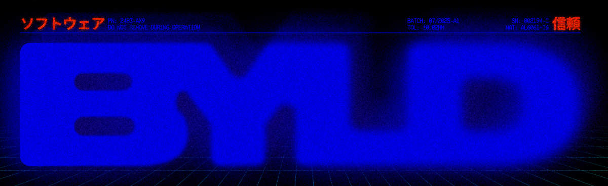

<div align="center">
  
</div>

Byld is a developer-led agency that co-builds software products with ambitious founders. We pair vetted senior engineers and designers with teams that need to ship fast and scale with confidence.

# @byldpartners/cli

CLI tool for scaffolding new projects with curated full-stack presets. A wrapper around [create-better-t-stack](https://www.better-t-stack.dev) with Byld's opinionated configurations, custom GitHub Actions, and additional package support.

## Installation

Install the Byld CLI globally using npm:

```bash
npm install -g @byldpartners/cli
```

Or using pnpm:

```bash
pnpm add -g @byldpartners/cli
```

Or using bun:

```bash
bun add -g @byldpartners/cli
```

## Usage

### Create a New Project

The main command is `create` (or `c` for short):

```bash
byld create my-project
```

Or without specifying a project name (you'll be prompted):

```bash
byld create
```

### Project Setup Options

When you run `byld create`, you'll be presented with two options:

1. **Use a Byld preset** - Choose from our curated preset configurations
2. **Custom stack** - Build your own stack using better-t-stack's interactive prompts

### Byld Presets

We offer several preset configurations optimized for different use cases:

#### Full-Stack React
- **Stack**: React + Hono + Drizzle + SQLite + Better Auth
- **Best for**: Full-stack React applications
- **Description**: Perfect for building modern React applications with a robust backend

#### Next.js Stack
- **Stack**: Next.js + Hono + Prisma + PostgreSQL + Clerk
- **Best for**: Enterprise-ready Next.js applications
- **Description**: Production-ready stack with enterprise-grade authentication

#### T3 Stack
- **Stack**: Next.js + tRPC + Prisma + NextAuth
- **Best for**: Type-safe full-stack applications
- **Description**: The popular T3 stack configuration with end-to-end type safety

#### Minimal Stack
- **Stack**: TanStack Router + Hono + SQLite
- **Best for**: Small projects and prototypes
- **Description**: Lightweight and fast, perfect for small projects

### Custom Additions

After selecting your stack, you can optionally add:

- **Custom GitHub Actions**: Add your own workflow files to `.github/workflows/`
- **Additional npm packages**: Add extra dependencies to your project

The CLI will prompt you interactively for these additions.

### Agent Setup

During project creation, you'll be prompted to set up Claude Code agent configurations. This integrates the `setup-agent` command directly into the create flow, so you don't need to run it separately.

When enabled, you can interactively select:

- **Rules** - Agent behavior rules organized by category
- **Skills** - Reusable agent skills with descriptions
- **Hooks** - Session lifecycle and strategic compaction hooks
- **MCP configs** - Model Context Protocol server configurations

All selected items are installed to the `.claude/` directory inside your new project.

You can also run agent setup independently on any existing project:

```bash
byld setup-agent
```

### Example Workflow

```bash
# Install the CLI
npm install -g @byldpartners/cli

# Create a new project
byld create my-awesome-app

# Follow the interactive prompts:
# 1. Choose "Use a Byld preset" or "Custom stack"
# 2. If preset, select from available presets
# 3. Optionally add custom GitHub Actions or packages
# 4. Optionally set up Claude Code agent (rules, skills, hooks, MCP configs)
# 5. Wait for project creation to complete

# Navigate to your project
cd my-awesome-app

# Start development
npm run dev
```

## Commands

### `byld create [project-name]`

Create a new project with the specified name (or be prompted for it).

**Aliases**: `byld c`

**Options**: None (all configuration is done interactively)

### `byld setup-agent`

Interactively set up Claude Code agent rules, skills, hooks, and MCP configs for the current project directory.

**Aliases**: `byld sa`

### `byld help`

## Custom Additions Guide

### Adding Custom GitHub Actions

When prompted, you can provide file paths to GitHub Actions workflow files. These will be copied to your project's `.github/workflows/` directory.

**Example:**
```
Enter GitHub Action file paths (comma-separated): ./my-workflow.yml, ./another-workflow.yml
```

### Adding Custom npm Packages

You can add additional npm packages during project creation. Specify packages with optional versions:

**Examples:**
```
Enter package names (comma-separated): lodash, axios@1.0.0, @types/node
```

The CLI will:
1. Add packages to `package.json`
2. Optionally install them immediately (if you choose to)

## What's Under the Hood?

Byld CLI is a wrapper around [create-better-t-stack](https://www.better-t-stack.dev), providing:

- Curated preset configurations
- Custom additions support
- Integration with better-t-stack

## Contributing

We welcome contributions! Please feel free to submit issues or pull requests.

## License

MIT

## Support

For support, visit [https://byld.dev](https://byld.dev) or open an issue on GitHub.

---

**Built with ❤️ by [Byld](https://byld.dev)**

